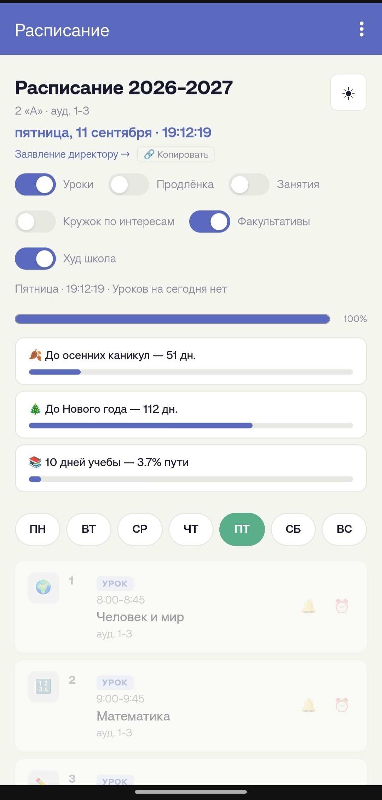
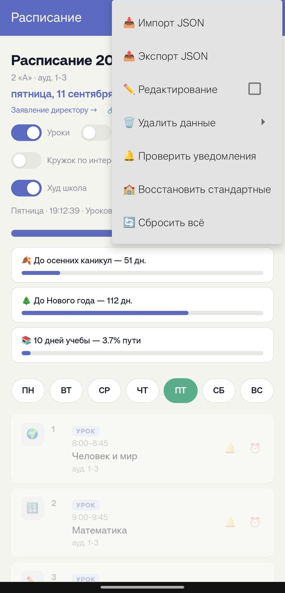
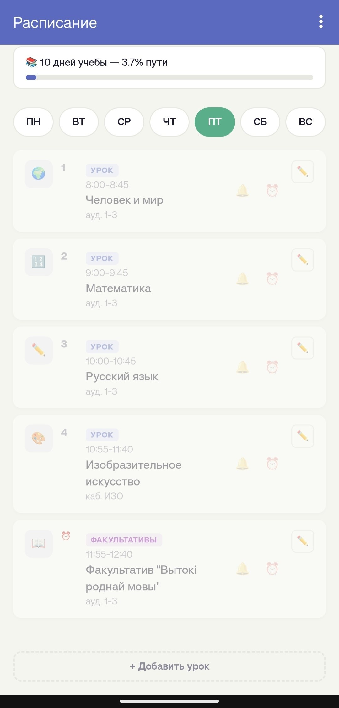
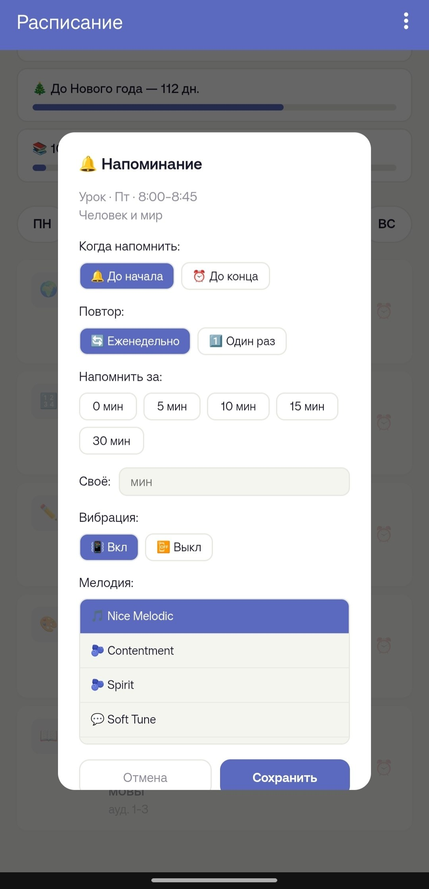

# 📚 Расписание

Приложение-расписание для начальной школы: школьные уроки, продлёнка, личные занятия
и любые свои расписания (художественная школа, кружки, факультативы) — в одном экране.

- **Android** — приложение (WebView, работает офлайн), APK в [Releases](https://github.com/vividlyvividlife/schedule/releases/latest)
- **Web** — те же файлы открываются в браузере (GitHub Pages)

## 📥 Установка (Android 8.0+)

1. Скачайте `schedule.apk` со страницы [Releases](https://github.com/vividlyvividlife/schedule/releases/latest)
2. Разрешите установку из неизвестных источников (Android попросит сам)
3. Готово — интернет приложению не нужен

> ⚠️ Обновление с версии 1.0: APK теперь подписан новым ключом — сначала **удалите старое
> приложение** (предварительно экспортируйте данные: меню → 📤 Экспорт JSON → 💾 Всё расписание),
> затем установите новое и импортируйте файл обратно.

## 🖼 Скриншоты

<table>
  <tr>
    <td></td>
    <td></td>
  </tr>
  <tr>
    <td></td>
    <td></td>
  </tr>
</table>

## ✨ Возможности

- Школьные уроки по дням: время, кабинет, место, преподаватель, цвет и иконка
- Продлёнка, личные занятия и **любое количество своих расписаний**
- Тумблеры сверху: включить/выключить любое расписание (данные при этом не удаляются)
- Верхний прогресс-бар дня — по **всем включённым** расписаниям вместе
- Строка статуса: «Сейчас: …» / «Следующий: …» с обратным отсчётом
- Отсчёты до каникул, Нового года и процент учебного года
- 🔔 Напоминания: до начала или до конца занятия, за 0–30+ минут, еженедельно или один раз,
  своя мелодия и вибрация
- Тёмная тема (кнопка ☾/☀ в шапке)
- Экспорт/импорт JSON, восстановление стандартного расписания, полный сброс

## 📱 Как пользоваться

### Просмотр

- Вкладки **ПН–ВС** или горизонтальный свайп — переключение дней
- Тумблеры в шапке показывают/скрывают расписания: «Уроки», «Продлёнка», «Занятия»
  (личные) и ваши собственные типы
- Карточка текущего занятия заполняется прогрессом, строка под шапкой показывает,
  что идёт сейчас и сколько осталось

### Как добавить урок

1. Меню (⋮) → **✏️ Редактирование**
2. Внизу списка дня — **«+ Добавить урок»**
3. Заполните поля: день, номер, предмет, время (`08:30–09:15`), кабинет, место, преподаватель
4. **Тип**: «Урок» — школьное расписание; впишите своё название (например «Худ школа») —
   так создаётся новое расписание, у него появится свой тумблер в шапке
5. Выберите цвет карточки и иконку предмета → **Сохранить**

Изменить или удалить один элемент: ✏️ на карточке (в режиме редактирования).

### Напоминания

- На карточке: **🔔 — до начала**, **⏰ — до конца** занятия
- «Напомнить за»: 0 / 5 / 10 / 15 / 30 минут или своё число. **0 = напомнить ровно
  в момент начала (или конца)**
- Повтор: еженедельно или один раз; мелодия — встроенные или своя с телефона; вибрация вкл/выкл
- Под активным колокольчиком мелким шрифтом подписано, за сколько минут он сработает
- Снять напоминание — повторный клик по тому же колокольчику

### Экспорт и импорт

Меню (⋮) → 📤 **Экспорт JSON**:

| Пункт | Что сохраняет |
|---|---|
| 💾 Всё расписание | **Всё сразу**: уроки, личные, продлёнку, все свои типы — лучший вариант для бэкапа |
| 📄 Только уроки | Школьное расписание |
| 🤸 Только занятия | Личные занятия + все свои типы расписаний |
| 🎒 Только продлёнку | Продлёнка |
| ⭐ … | Отдельное своё расписание |

📥 **Импорт JSON** понимает любой из этих файлов и **добавляет** данные к текущим,
ничего не затирая.

### Удаление и восстановление

- 🗑 **Удалить данные** (меню → подменю) — удаляет выбранное расписание целиком
- 🏫 **Восстановить стандартные** — вернёт стандартные уроки, продлёнку и типы
  «Кружок по интересам» и «Факультативы». **Личные занятия и свои типы будут стёрты** —
  сначала экспортируйте!
- 🔄 **Сбросить всё** — полное очищение, приложение станет пустым
- После сброса всё возвращается импортом ранее экспортированного файла

## 🛠 Сборка из исходников

```bash
cd android
./gradlew assembleRelease
# → android/app/build/outputs/apk/release/schedule.apk
```

Требуется JDK 17 и Android SDK (compileSdk 35). Release-ключ хранится вне репозитория:
пути и алиас — в `android/app/build.gradle`, пароли — в `~/.gradle/gradle.properties`
(`SCHEDULE_RELEASE_STORE_PASSWORD`, `SCHEDULE_RELEASE_KEY_PASSWORD`). Без них сборка
автоматически подписывается отладочным ключом.

## 📁 Структура

```
├── index.html            # входная страница (web + Android WebView)
├── script.js             # логика расписания
├── engines.js            # часы, отсчёты, прогресс-бары карточек
├── style.css             # стили, тёмная тема
├── timeSchedule.json     # стандартное расписание (уроки, продлёнка, типы)
├── holidays.json         # каникулы и праздники
├── zayavlenie.html       # заявление директору (web)
├── android/              # Kotlin-обёртка: WebView, напоминания, экспорт/импорт
└── screenshots/          # скриншоты для README
```

## 📄 Лицензия

MIT — см. [LICENSE](LICENSE).
